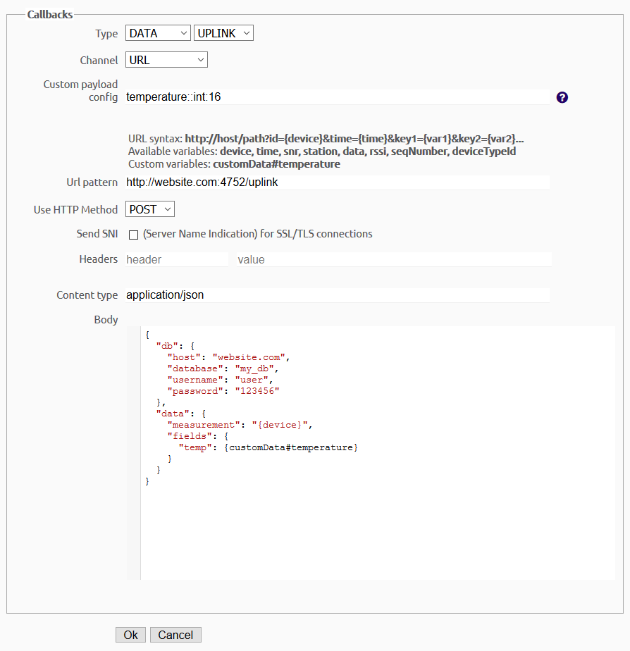

# Sigfox to InfluxDB convertor

[](https://github.com/pilotak/docker-sigfox-influxdb/actions)


Simple and effective Sigfox callback to InfluxDB convertor - all set from Sigfox backend.
There isn't an easy way of saving data from Sigfox callback mechanism to InfluxDB directly, that's why this API server was created. It's a universal API server where no credentials are required for setting up which allows you to save the data to seperate DBs or measurement tables without restarting the whole thing.

## Install with `docker-compose`
```yaml
version: "3.6"

services:
  sigfox:
    container_name: sigfox
    image: pilotak/sigfox-influxdb
    restart: always
    ports:
      - 4752:8080
```

## Simple JSON data example
```json
{
  "db": {
    "host": "website.com",
    "database": "my_db",
  },
  "data": {
    "measurement": "{device}",
    "fields": {
      "temp": {customData#temperature}
    }
  }
}
```

You can also modify values saved to db, it uses [math.js](https://mathjs.org/docs/expressions/parsing.html#evaluate) where the actual field variable is `x`.
In order to apply the math, name has to match with the one under `data.fields`. All other stay the same.

## Full JSON data example
```json
{
  "db": {
    "host": "website.com",
    "database": "my_db",
    "port": 5987,
    "username": "user",
    "password": "123456"
  },
  "data": {
    "measurement": "{device}",
    "fields": {
      "temp": {customData#temperature}
    }
  },
  "math": {
    "temp": "(x*2)-1.5"
  }
}
```

## Sigfox backend setting

